# **CVDS - LABORATORIO 2 - PATTERNS**

Angie Natalia Mojica Diaz\
Daniel Antonio Santanilla Arias

## **SOBRE APACHE MAVEN**

### **¿Cuál es su mayor utilidad?** 
El objetivo principal de Maven es permitir que un desarrollador comprenda el estado completo de un esfuerzo de desarrollo en el menor tiempo posible. Para lograr este objetivo, Maven se ocupa de varias áreas: [1][1]

* Facilitar el proceso de construcción.
* Proporcionar un sistema de construcción uniforme.
* Proporcionar información de proyectos de calidad.
* Fomentar mejores prácticas de desarrollo.

### **Fases de maven** 
A continuación se presenta cada uno de los ciclos de vida de construcción definidos por una lista de fases donde cada una de estas presenta un estado en el ciclo de vida. [2][2]

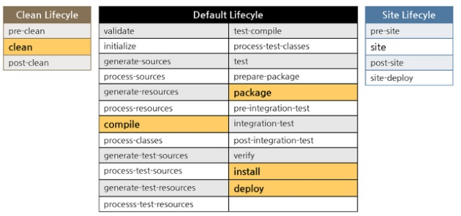

* *Maven Validate*: Se encarga de validar que el proyecto dispone de toda la información necesaria para ser procesado.
* *Maven Compile*: Se encarga de compilar los ficheros fuentes .java y generar en las carpetas de destino los compilados.
* *Maven Test*: Una vez se ha compilado el código se ejecutan las pruebas unitarias que se han construido para él . Asegurandose que el código es correcto.
* *Maven Package*: Se encarga de empaquetar el código a un formato standard de Java que permita su ejecución o despliegue en servidor. Los empaquetados más habituales: JAR, WAR, EAR.
* *Maven Verify*: Esta fase del ciclo de vida se encarga de lanzar los test de integración para confirmar que todo funciona correctamente y que la calidad es la correcta.
* *Maven LifeCycle(Install)*: Se encarga de desplegar el artefacto en el repositorio local con su versionado de tal forma que otros artefactos puedan hacer uso de él.
* *Maven Deploy*: Es una fase clave cuando se dispone de una serie de artefactos que se desean compartir entre desarrollos ya que permite desplegar el artefacto en un servidor remoto de tal forma que otros desarrolladores puedan utilizarlo .
### **Ciclo de vida de la construcción**
Maven cuenta con tres tipos de ciclo de vida de construcción:
* *default:* Gestiona la construcción, empaquetamiento y despliegue.
* *clean:* Gestiona la limpieza del espacio de trabajo.
* *site:* Gestiona la creación del sitio web de maven (documentaciones).
### **Para qué sirven los plugins** 
Los plugins son artefactos que proporcionan objetivos a Maven. Hay plugins encargados de gestionar las dependencias, plugins encargados de compilar código Java, plugins encargados de ejecutar pruebas de JUnit, plugins encargados de empaquetar el código en un fichero JAR, etc. 

Por ejemplo, el plugin Compiler tiene dos objetivos: compile y testCompile.
### **¿Qué es y para qué sirve el repositorio central de maven?**
El repositorio de Maven (o repositorio central) tiene una estructura que permite que los archivos como, por ejemplo, archivos JAR tengan versiones distintas que se descubren después fácilmente con un mecanismo de denominación bien conocido. [3][3]
## **EJERCICIO DE LAS FIGURAS**

### **CREAR UNPROYECTO CON MAVEN**

Buscar cómo se crea un proyecto maven con ayuda de los arquetipos(archetypes).

Busque cómo ejecutar desde línea de comandos el objetivo "generate" del plugin "archetype",con los siguientes
parámetros:\
Grupo: edu.eci.cvds\
Id del Artefacto: Patterns\
Paquete: edu.eci.cvds.patterns\
archetypeArtifactId: maven-archetype-quickstart

```console
mvn archetype:generate
```

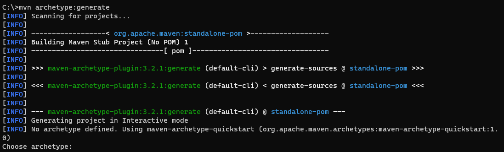
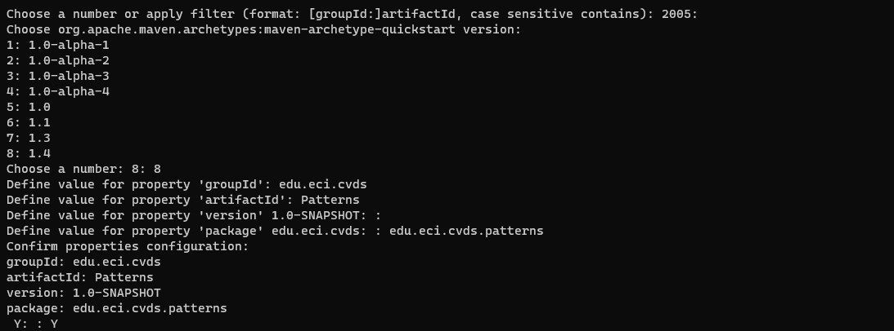

Para visualizar la estructura hacemos los comandos

```console
cd Patterns
tree /f
```

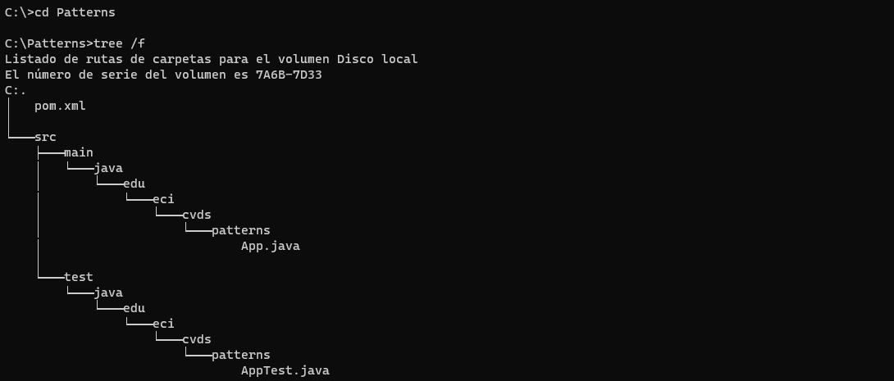

### **AJUSTAR ALGUNAS CONFIGURACIONES EN EL PROYECTO**

Hay que cambiar la version delcompilador de Java a la versión 8, para ello, agregue la sección properties antes de la sección de
dependencias:

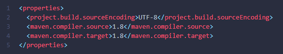

### **COMPILAR Y EJECUTAR**

Para compilar usar el comando

```console
mvn package
```

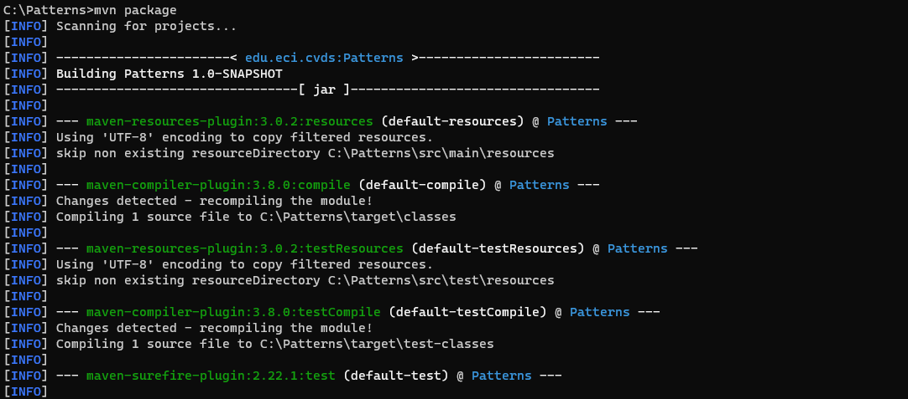
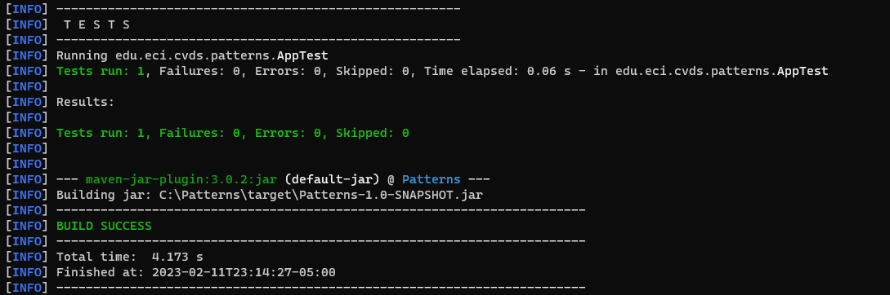

#### **Objetivo del parametro package**

Para ejecutar usar el comando

```console
mvn exec:java -Dexec.mainClass="edu.eci.cvds.patterns.App"
```

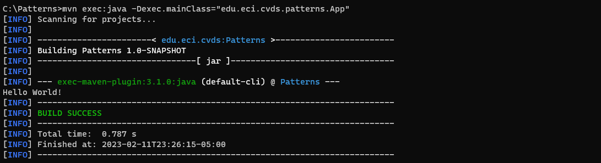
Realice elcambio en la clase App.java para crear un saludo personalizado, basado en los parámetros de entrada a la aplicación.

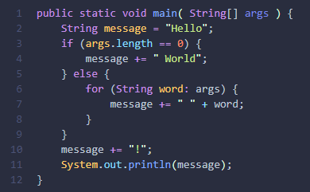

Para mandar parametros al plugin "exec" se da de la siguiente manera

```console
mvn exec:java -Dexec.mainClass="edu.eci.cvds.patterns.App" -Dexec.args="'argument1' 'argument2'"
```

Ejecutar nuevamente la clase desde línea de comandos y verificar la salida: Hello World!


Ejecutar la clase desde línea de comandos enviando su nombre como parámetro y verificar la salida. Ej: Hello Pepito!

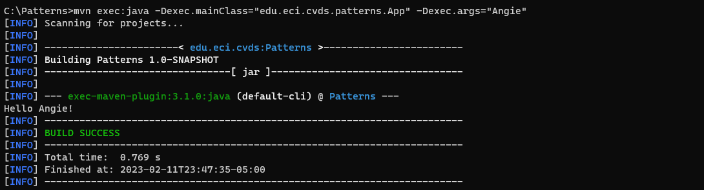
Ejecutar la clase con su nombre y apellido como parámetro.

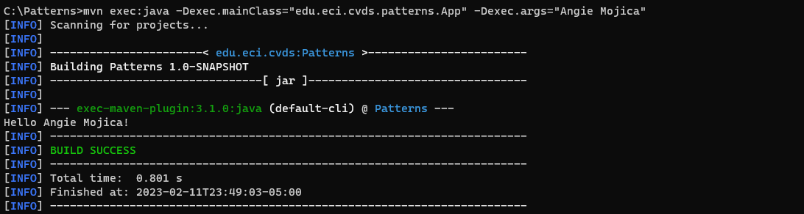
Verifique cómo enviar los parámetros de forma "compuesta" para que el saludo se realice con nombre y apellido. Ejecutar nuevamente y verificar la salida en consola. Ej: Hello Pepito Perez!

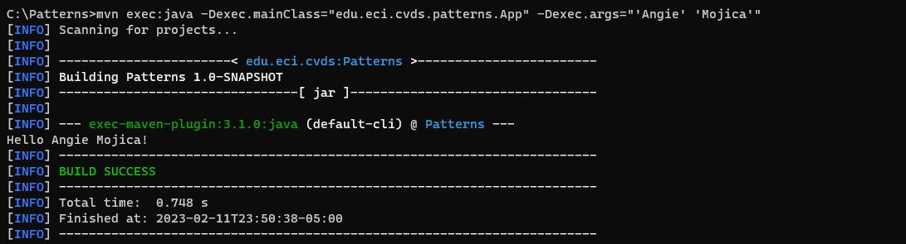

### **HACER EL ESQUELETO DE LA APLICACION**

Hacer el esqueleto de la aplicacion de acuerdo a la guia de laboratorio.

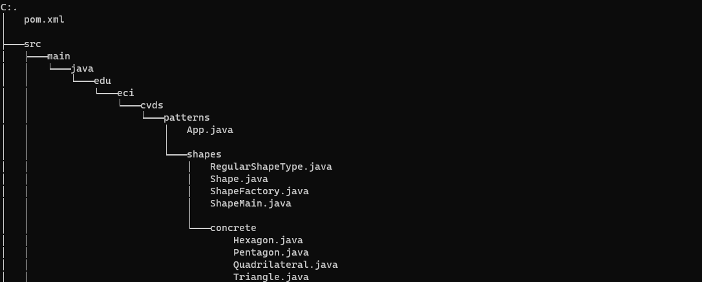
Ejecute múltiples veces la clase ShapeMain, usando el plugin exec de maven con los siguientes parámetros y verifique la salida en consola para cada una:\
Sin parámetros
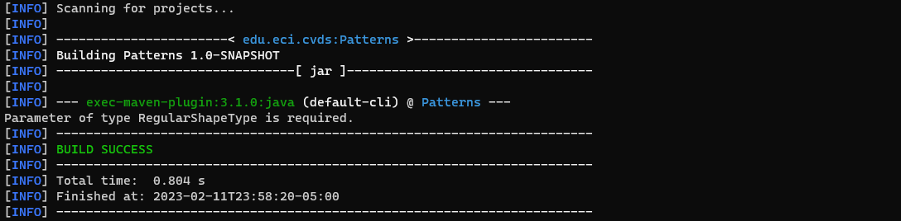
Parámetro: qwerty
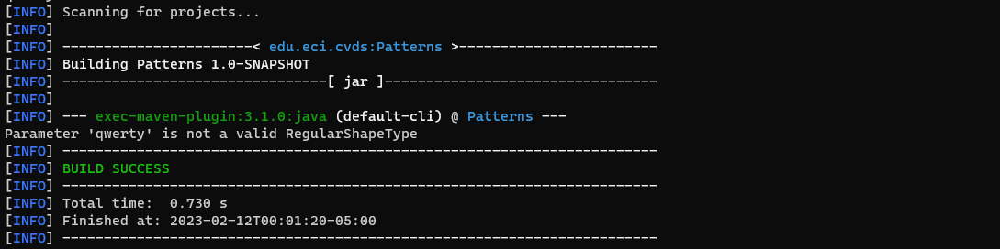
Parámetro: pentagon
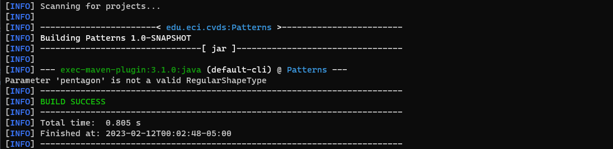
Parámetro: Hexagon
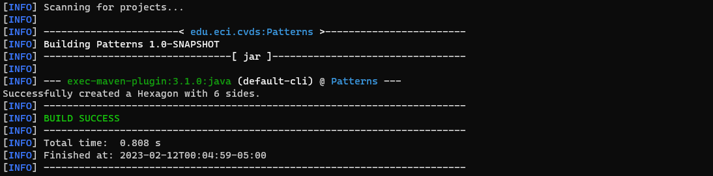

#### **¿Cuál(es) de las anteriores instrucciones se ejecutan y funcionan correctamente y por qué?**
Todas las intrucciones ejecutadas funcionan correctamente, pues hace las correspondientes validaciones como lo son: que tenga párametro, que exista la figura ingresada y por último si cumple lo anterior muestra los vértices de la figura.

[1]:https://maven.apache.org/what-is-maven.html "Maven"
[2]:https://www.arquitecturajava.com/que-es-un-maven-lifecycle-y-como-funciona "Fases CVDS"
[3]:https://www.ibm.com/docs/es/ibm-mq/9.1?topic=applications-java-application-development-using-maven-repository "Repositorio Maven"