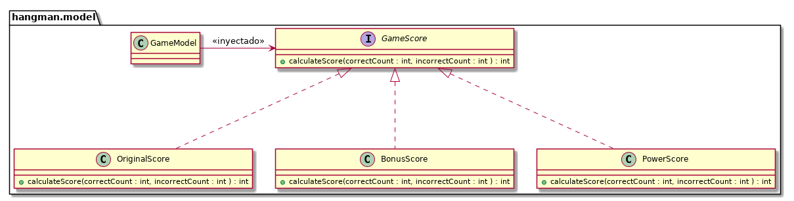
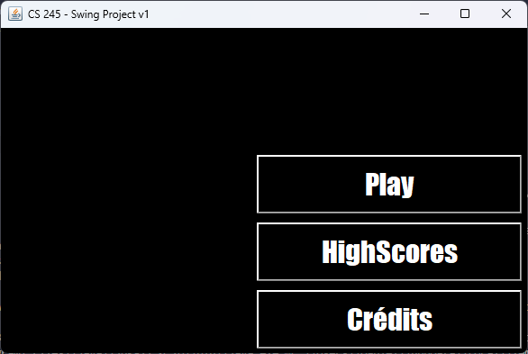
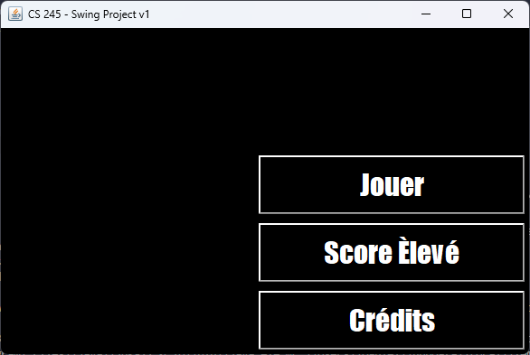

# CVDS - LABORATORIO 4 - HANGMAN

**Integrantes:** Angie Natalia Mojica - Daniel Antonio Santanilla

## Desarrollo Dirigido por Pruebas + DIP + DI + Contenedores Livianos

---

### Parte I

1. Clonar el proyecto.

   Se clona el proyecto desde la consola `git clone <url_proyect>`.

2. A partir del código existente, implemente sólo los cascarones del modelo. <a id="cascarones"></a>

   

3. Haga la especificación de los métodos calculateScore, a partir de las especificaciones:

   * OriginalScore:
      * Es el esquema actual, se inicia con 100 puntos.
      * No se bonifican las letras correctas.
      * Se penaliza con 10 puntos con cada letra incorrecta.
      * El puntaje minimo es 0.

   * BonusScore:
      * El juego inicia en 0 puntos.
      * Se bonifica con 10 puntos cada letra correcta.
      * Se penaliza con 5 puntos cada letra incorrecta.
      * El puntaje mínimo es 0

   * PowerBonusScore:
      * El juego inicia en 0 puntos.
      * La $i-ésima$ letra correcta se bonifica con $5^i$.
      * Se penaliza con 8 puntos cada letra incorrecta.
      * El puntaje mínimo es 0
      * Si con las reglas anteriores sobrepasa 500 puntos, el puntaje es 500.

4. Haga commit de lo realizado hasta ahora. Desde la terminal:

   Desde la consola

   ```bash
   git add .
   git commit -m "Especificación de métodos"
   ```

5. Actualice el archivo `pom.xml` e incluya las dependencias para la ultima versión de JUnit y la versión del compilador de Java a la versión 8 .

   Se añaden las dependencias JUnit y la version del compilador 8.

   ```xml
   <properties>
      <project.build.sourceEncoding>UTF-8</project.build.sourceEncoding>
      <maven.compiler.source>1.8</maven.compiler.source>
      <maven.compiler.target>1.8</maven.compiler.target>
   </properties>
   <dependency>
      <groupId>junit</groupId>
      <artifactId>junit</artifactId>
      <version>4.13.2</version>
      <scope>test</scope>
   </dependency>   
   ```

6. Teniendo en cuenta dichas especificaciones, en la clase donde se implementarán las pruebas (GameScoreTest), en los comentarios iniciales, especifique las clases de equivalencia para las tres variantes de GameScore, e identifique condiciones de frontera.

   Se comentan las clases de equivalencia para las variantes de GameScore

7. Para cada clase de equivalencia y condición de frontera, implemente una prueba utilizando JUnit.

    Se crean los primeros test con las clases de equivalencia en `src/test/java/hangman/model/GameScoreTest.java`.

8. Haga commit de lo realizado hasta ahora. Desde la terminal:

   ```bash
   git add .
   git commit -m "Implementación de pruebas"
   ```

9. Realice la implementación de los 'cascarones' realizados anteriormente. Asegúrese que todas las pruebas unitarias creadas en los puntos anteriores se ejecutan satisfactoriamente.

   Se crea la lógica de los cascarones presentados: [Ir ->](#cascarones)

10. Al finalizar haga un nuevo commit:

    ```bash
    git add .
    git commit -m "Implementación del modelo"
    ```

11. Para sincronizar el avance en el respositorio y NO PERDER el trabajo, use el comando de GIT para enviar los cambios:

    ```bash
    git push <URL_Repositorio>
    ```

### Parte II

Actualmente se utiliza el patrón FactoryMethod que desacopla la creación de los objetos para diseñar un juego de ahorcado (revisar createGUIUsingFactoryMethod en SwingProject, el constructor de la clase GUI y HangmanFactoryMethod).

En este taller se va a utilizar un contenedor liviano ([GoogleGuice](https://github.com/google/guice)) el cual soporta la inyección de las dependencias.

1. Utilizando el HangmanFactoryMethod (MétodoFabrica) incluya el OriginalScore a la configuración.

   Se añade OiginalScore a la configuracion de HangmanFactory, se realiza en:\
   `src/main/java/hangman/setup/factoryMethod/HangmanDefaultFactoryMethod.java`
   `src/main/java/hangman/setup/factoryMethod/HangmanFactoryMethod.java`

Incorpore el Contenedor Liviano Guice dentro del proyecto:

* Revise las dependencias necesarias en el `pom.xml`.

  Se asoscian nuevas dependencias en el `pom.xml`

  ```xml
  <dependency>
      <groupId>com.google.inject</groupId>
      <artifactId>guice</artifactId>
      <version>4.0</version>
   </dependency>
  ```

* Modifique la inyección de dependencias utilizando guice en lugar del método fábrica.

  Modificando la inyección de dependencias para utilizar guice en lugar del método fábrica.

  ```java
   public static void main(String[] args) {
      createGUIUsingGuice().play();
   }
  ```

* Configure la aplicación de manera que desde el programa SwingProject NO SE CONSTRUYA el Score directamente, sino a través de Guice asi mismo como las otras dependencias que se están inyectando mediante la fabrica.

  Realizando inyección de dependencias en el proyecto en:
  `src/main/java/hangman/setup/guice/HangmanFactoryServices.java`

  ```java
  @Override
   protected void configure() {
      bind(Language.class).to(English.class);
      bind(GameScore.class).to(OriginalScore.class);
      bind(HangmanDictionary.class).to(EnglishDictionaryDataSource.class);
      bind(HangmanPanel.class).to(HangmanStickmanPanel.class);
   }
  ```

  

  Añadiendo comportamiento en:
  `src/main/java/hangman/model/GameModel.java`

  ```java
  @Inject
  private GameScore gameS;
  ```

* Mediante la configuración de la Inyección de
  Dependencias se pueda cambiar el comportamiento del mismo, por
  ejemplo:
  * Utilizar el esquema OriginalScore.
  * Utilizar el esquema BonusScore.
  * Utilizar el idioma francés.
  * Utilizar el diccionario francés.

  Usando idioma francés y diccionario francés con el esquema BonusScore.

  ```java
   @Override
   protected void configure() {
      bind(Language.class).to(French.class);
      bind(GameScore.class).to(BonusScore.class);
      bind(HangmanDictionary.class).to(FrenchDictionaryDataSource.class);
      bind(HangmanPanel.class).to(HangmanStickmanPanel.class);
   }
  ```

  Aplicación:

  

### Referencias

Referencia de guía de laboratorio: [Laboratorio](https://github.com/An6ie02/CVDS_LAB04/blob/master/README.md)\
Referencia de guía guice [Guice Reference](https://github.com/PDSW-ECI/LightweighContainers_DepenendecyInjectionIntro-WordProcessor).
