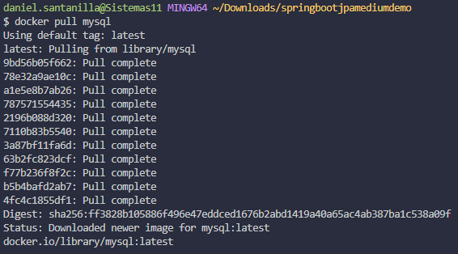

# CVDS-LAB07 - CI/CD - Manejo de Data - ORM

**Integrantes:** Angie Natalia Mojica - Daniel Antonio Santanilla

### PARTE II. USANDO SPRING DATA DESDE CERO

1. Revisemos las clases: DataAccess.java y veamos la manera en la que se crearon los métodos: login, employeeFares, getFareTotal.

    ```java
    public static Employee login(String employeeEmail, String employeePassword) {
        try {
            LOGIN.clearParameters();
            LOGIN.setString(1, employeeEmail);
            LOGIN.setString(2, employeePassword);
            try (ResultSet rs = LOGIN.executeQuery()) {
                if (rs.next()) {
                    Employee emp = new Employee(rs.getInt("id"), rs.getString("username"), rs.getString("password"));
                    return emp;
                } else
                    return null;
            }
        } catch (SQLException sqlEx) {
            sqlEx.printStackTrace();
            return null;
        }
    }

    /**
     * Return all the fares for a given Employee object
     */
    public static List<Fare> employeeFares(Employee emp) {
        return employeeFares(emp.getID());
    }

    public static float getFareTotal(int empID){
        try {
            GETTOTAL.clearParameters();
            GETTOTAL.setInt(1, empID);
            ResultSet rs = GETTOTAL.executeQuery();
            if (rs.next()){ return (rs.getInt("totalfare")/100.0f);}
            else return -1;
        } catch (SQLException sqlEx) {
            sqlEx.printStackTrace();
            return -1;
        }   
    }
    ```

2. Actualmente el proyecto se conecta a la base de datos usando JDBC (Java Data Base Connection)

    ```java
    private static final String DB_DRIVER = "com.mysql.jdbc.Driver";
    ```

3. Crea un nuevo repositorio en tu cuenta de github, y sigue las instrucciones del siguiente tutorial de spring. [Sprint Tutorial](https://medium.com/@saultobias13/a-quick-start-with-spring-boot-and-spring-data-jpa-32718a8f4706)

    Creamos una plantilla Spring usando: [Start Spring](https://start.spring.io/)\
    

    Revisamos las dependencias del proyecto

    ```xml
    <dependencies>
        <dependency>
            <groupId>org.springframework.boot</groupId>
            <artifactId>spring-boot-starter-data-jpa</artifactId>
        </dependency>
        <dependency>
            <groupId>com.h2database</groupId>
            <artifactId>h2</artifactId>
            <scope>runtime</scope>
        </dependency>
        <dependency>
            <groupId>org.springframework.boot</groupId>
            <artifactId>spring-boot-starter-test</artifactId>
            <scope>test</scope>
            <exclusions>
                <exclusion>
                    <groupId>org.junit.vintage</groupId>
                    <artifactId>junit-vintage-engine</artifactId>
                </exclusion>
            </exclusions>
        </dependency>
    </dependencies>
    ```

    Modificamos `aplication.properties`

    ```Java Properties
    spring.datasource.url=jdbc:h2:mem:testdb
    spring.datasource.driverClassName=org.h2.Driver
    spring.datasource.username=sa
    spring.datasource.password=password
    spring.jpa.database-platform=org.hibernate.dialect.H2Dialect
    ```

    Creamos el modelo en `edu.eci.cvds.springbootjpamediumdemo.model` como indica la el tutorial de Spring

    Creamos un repositorio en `edu.eci.cvds.springbootjpamediumdemo.repository` como indica la el tutorial de Spring

    Creamos el servicio en `edu.eci.cvds.springbootjpamediumdemo.service` como indica la el tutorial de Spring

    Ejecutamos la aplicación\
    

4. Crearemos una base de datos local usando Docker:

    Descargar imagen de MySQL con el comando

    ```bash
    docker pull mysql
    ```

    

    Correr un contenedor de MySQL

    ```bash
    docker run -p 3306:3306 --name some-mysql -e MYSQL_ROOT_PASSWORD=my-secret-pw -d mysql:latest
    ```

    

    Usando un cliente de base de datos (DBeaver) nos conectamos a nuestra base de datos\
    

    Crear una tabla de la base de datos: EMPLOYEE.\
    

5. Buscar cómo conectar nuestro proyecto de spring a una base de datos MySql.

    En nuestro proyecto añadimos la dependiencia `mysql-connector-j` al `pom.xml`

    ```xml
    <!-- https://mvnrepository.com/artifact/com.mysql/mysql-connector-j -->
    <dependency>
        <groupId>com.mysql</groupId>
        <artifactId>mysql-connector-j</artifactId>
        <version>8.0.32</version>
    </dependency>
    ```

    Cambiamos las configuraciones de la aplicación

    ```Java Properties
    spring.datasource.url=jdbc:mysql://localhost:3306/sys
    spring.datasource.username=root
    spring.datasource.password=my-secret-pw
    spring.jpa.hibernate.ddl-auto=update
    ```

    Volvemos a ejecutar la aplicación\
    
