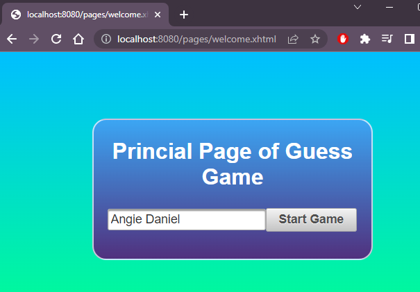
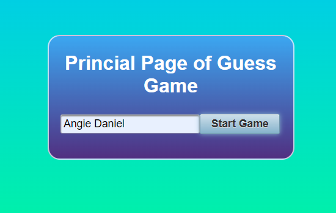
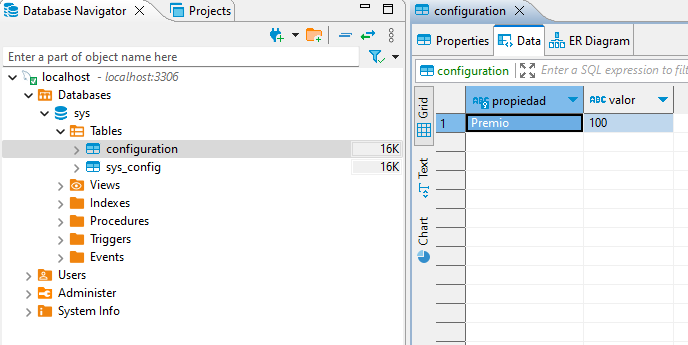
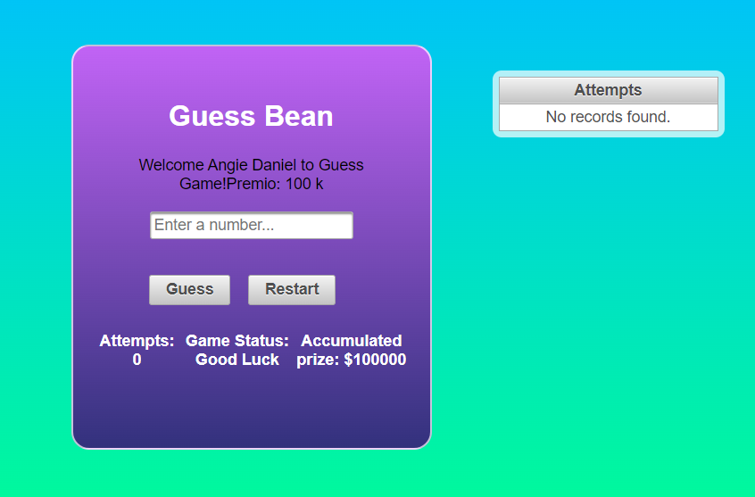

# CVDS - LAB08 INTEGRACIÓNCONCEPTOS (JSF, Spring Data, Arquitectura por capas)

**Integrantes:**
Angie Natalia Mojica - Daniel Antonio Santanilla
---

## PARTE I. INTEGRACIÓN DE SPRING CON EL PROYECTO WEB

Sobre el proyecto web realizado en el laboratorio 5, se trabajará para integrar el desarrollo realizado con el uso de SPRING. El primer paso será, poder desplegar el proyecto web con toda la configuración de SPRING que se indica en el siguiente tutorial. [tutorial](https://www.logicbig.com/tutorials/spring-framework/spring-boot/boot-primefaces-integration.html#google_vignette)

1. Logar desplegar la página que muestran en el tutorial. (renombrar el nombre de la página si es necesario)

    Siguendo el tutorial propuesto logramos desplegar la página del tutorial\
    

2. Lograr desplegar la página del tutorial del laboratorio 5

    Desplegando la página del laboratorio 5, añadiendo dependencias al `pom.xml`\
    

3. Crear un página de bienvenida en donde:
    - Se le pida el nombre del jugador. (Esta información se debe almacenaren un Bean detipo Aplicación llamado ‘UserBean’)

        Se agrega `UserBean.java` en `edu.eci.cvds.backingbean`

    - Se le dé la bienvenida al juego y tenga un botón “Iniciar”, el cual una vez se presione direccione a la página anteriormente creada en donde el jugador podrá jugar.

        

## PARTE II. INTEGRACIÓN DE SPRING DATA CON EL PROYECTO WEB

1. Tomando lo logrado en el laboratorio 7 (La conexión con la base de datos que corre en Docker), se deberá integrar al sistema de tal forma qué se obtenga de la base de datos el valor del premio:100
    - Crear una tabla llamada CONFIGURATION con dos columnas:
        - PROPIEDAD: VARCHAR
        - VALOR: VARCHAR
    - Agregar un registro:
        - En la columna PROPIEDAD colocar el valor: “Premio”
        - En la columna VALOR colocar el valor: “100”.

    Se añade `GameConfiguration.java`, `GameRepository.java` y `GameService.java` a `edu.eci.cvds.backingbean` y el registro valor del registro en `GuessBean.java`

2. Crear la funcionalidad que obtenga ese valor de base de datos una vez se ingrese al juego (presión del botón iniciar).

    Se inicia una contenedor con MYSQL y luego se ejecuta la aplicación

    ```bash
    docker run --name some-mysql -e MYSQL_ROOT_PASSWORD=my-secret-pw -d mysql:tag
    ```

    Se observa la página principal\
    

    Se inicial el juego y se toma la propiedad de la base de datos\
    

    Se observa en el juego el premio\
    
