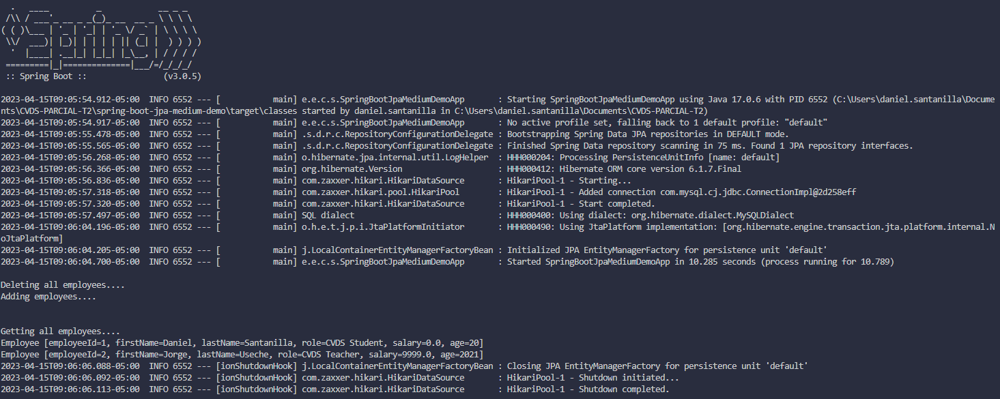
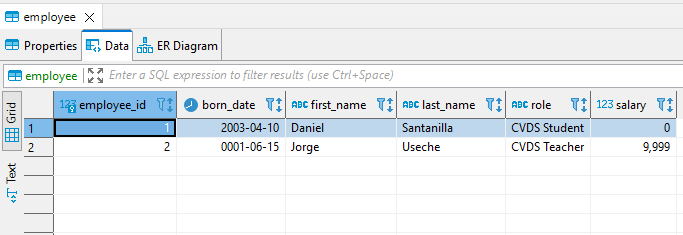

# CVDS-PARCIAL-T2

Parcial tercio 2 | Daniel Santanilla | 2023-1

En la práctica 7 se realizó una aplicación que al iniciar crea unos empleados, los consulta, actualizaba el primer empleado y eliminaba ese mismo.
Para esta parte se debe agregar una nueva propiedad a la entidad empleado que será la fecha de nacimiento, debe crear un método que permita calcular la edad.
Además deberá modificar el método al inicio run para qué al arrancar la aplicación, elimine todos los empleados existentes, luego debe crear 1 empleado qué tenga sus datos personales (de cada estudiante) y al profesor debe mostrarse qué en la base de datos se ve ese nuevo registro.
En los logs debe verse la edad calculada del empleado.

Se añade un metodo para calcular a edad en `edu.eci.cvds.springbootjpamediumdemo.model`

```java
public int getAge() {
    LocalDate actualDate = LocalDate.now();
    Period period = Period.between(bornDate, actualDate);
    return (int) period.getYears();
}
```

Se añade un metodo para elimnar todos los empleados en `edu.eci.cvds.springbootjpamediumdemo.service`

```java
public void deleteAllEmployees() {
    employeeRepository.deleteAll();        
}
```

Se cambia la forma de inciar la aplicacion  en `edu.eci.cvds.springbootjpamediumdemo`

```java
@Bean
public CommandLineRunner run() throws Exception {
    return (args) -> {
        
        System.out.println("\nDeleting all employees....");
        employeeService.deleteAllEmployees();

        System.out.println("Adding employees....\n");
        employeeService.addEmployee(new Employee("Daniel", "Santanilla", "CVDS Student", 0.00, LocalDate.of(2003, 4, 10)));
        employeeService.addEmployee(new Employee("Jorge", "Useche", "CVDS Teacher", 9999.00, LocalDate.of(0001, 6, 15)));
        
        System.out.println("\nGetting all employees....");
        employeeService.getAllEmployees().forEach(employee -> System.out.println(employee));
    };
}
```

Se ejecuta la aplicacion



Se observa el registro en la base de datos


